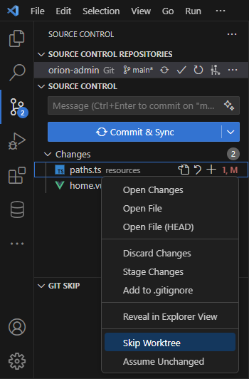
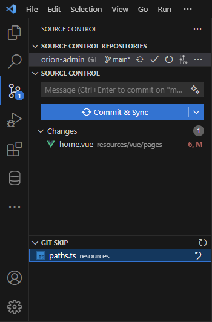

# Git Skip

This extension allows you to set Git's `skip-worktree` and `assume-unchanged` flags for files, directly from the source control pane.

This can be useful when you have local modifications on a file and want to prevent this file from being committed by accident (`Skip Worktree`), or to optimize the modification scan to exclude large files (`Assume Unchanged`).

These flags are *NOT* the same as adding a file to the `.gitignore`.

Learn more about the differences [in this great blog post](https://automationpanda.com/2018/09/19/ignoring-files-with-git/).

## In Action

 &nbsp; 

## Requirements

- You must be in a Git project.
- Only tracked files can be flagged.

## Known Issues

This is an alpha release, expect the unexpected ! Please open issues in this GitHub repo and/or contribute a PR.

- The context menu allows clicking on the flags for untracked files (but an error will be raised).

## TODO

- Decorations in "Git Skip" treeview to indicate if the skipped file is `skip-worktree` (`SW`) or `assume-unchanged` (`AU`)

## Release Notes

## 0.2.1

- Cleaned up readme and added badges.