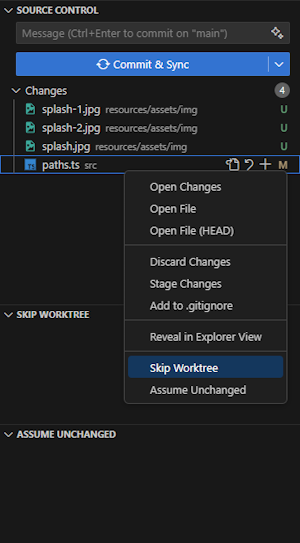

# Git Skip

This extension allows you to set Git's `skip-worktree` and `assume-unchanged` flags for files, directly from the source control pane.

This can be useful when you have local modifications on a file and want to prevent this file from being committed by accident _(Skip Worktree)_, or to optimize the modification scan to exclude large files _(Assume Unchanged)_.

These flags are *NOT* the same as adding a file to the `.gitignore`.

This extension is simply a shortcut for `git update-index {flag} {file}`, and listing the files with these flags.

This extension was born because a good collegue of mine finds it impressive that I can find extensions for everything in VSCode, but this one didn't exist _(yet)_.

See, Mitch ? There's really an extension for _everything_ !

## In Action

## Requirements

- You must be in a Git project.
- Only tracked files can be flagged.

## Known Issues

This is an alpha release, expect the unexpected ! Please open issues in this GitHub repo and/or contribute a PR.

- The context menu allows clicking on the flags for untracked files (but an error will be raised).

## TODO

- Add config options to hide one of the two flags

## Release Notes

### 0.1.0

Alpha release of the `Git Skip` extension.
